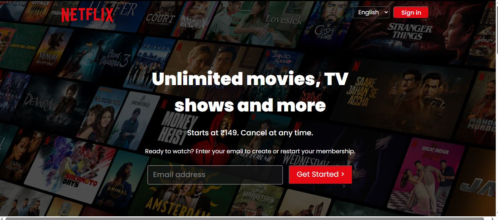
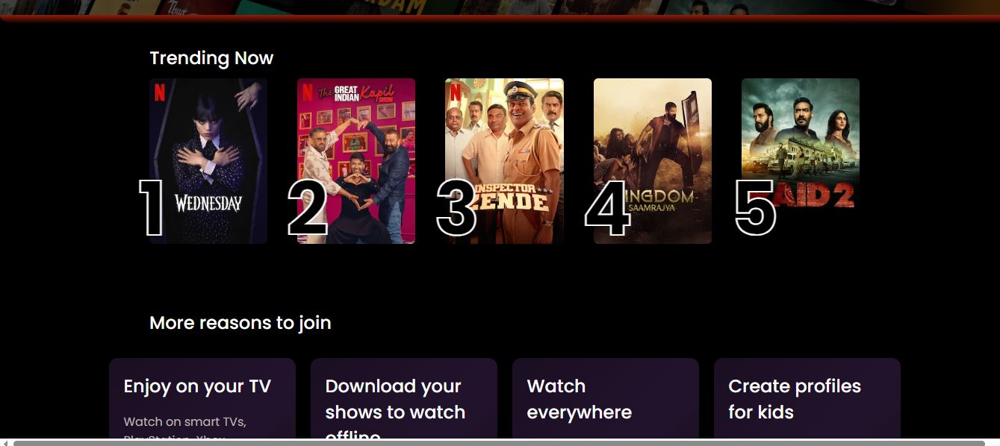
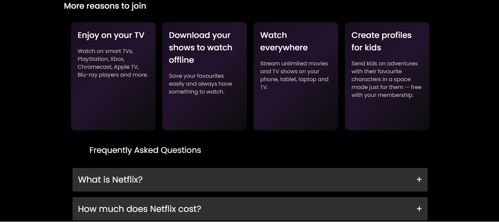
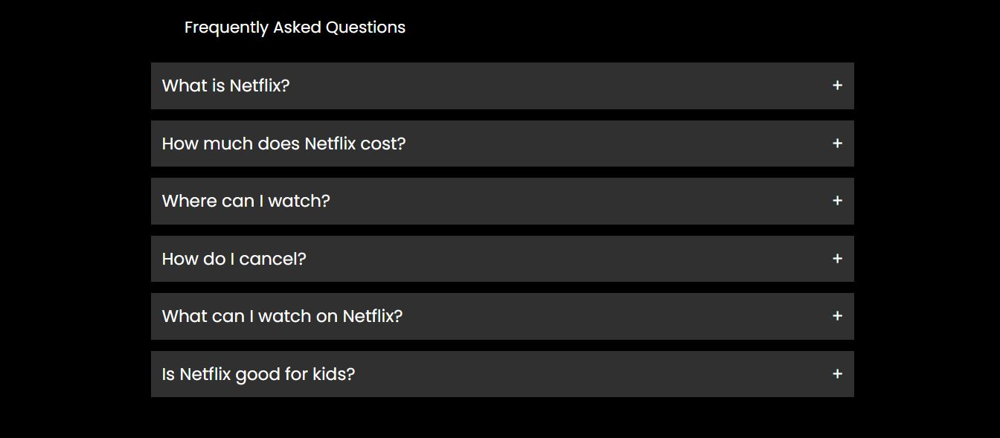
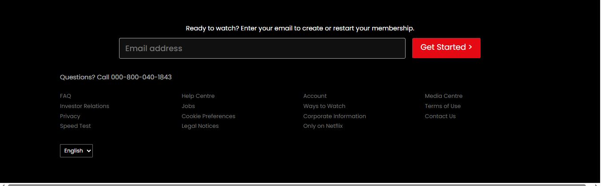

# 🎬 Netflix UI Clone

This project is a **clone of the current Netflix UI (as of September 16, 2025)**, recreated entirely using **HTML** and **CSS**.

The goal of this project was to **practice responsive web design, layout replication, and UI/UX accuracy**, without relying on AI tools.

---

## 🚀 Tech Stack
- **HTML5**
- **CSS**
- **Font Awesome / Heroicons** (for icons)

---

## 🖼️ Project Preview

  

  

  

  

  

  

---

## 🌿 Branch Information
> All code is available in the **`main`** branch.

---

